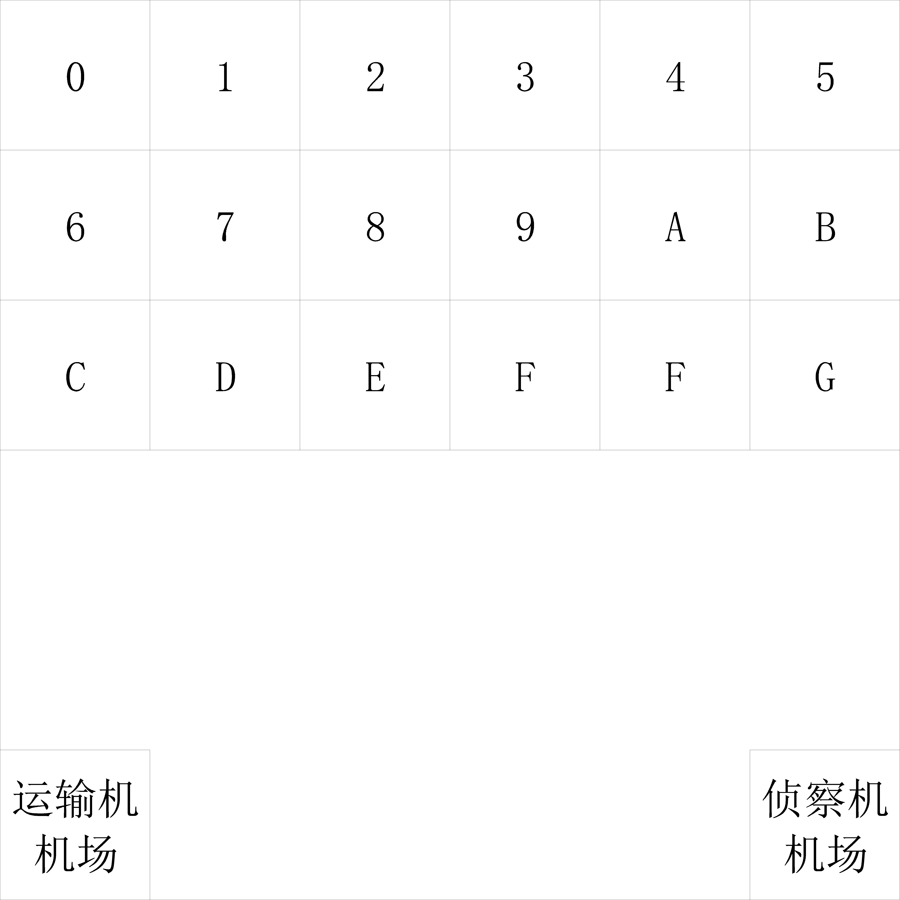

# "驼峰航线"赛比赛规则

## 一.飞行器要求

<table border="2" align="center" style="text-align:center;">
<tr>
  <td><b>组别</b></td>
  <td><b>小学组</b></td>
  <td><b>初中组</b></td>
  <td><b>高中组</b></td>
</tr>
<tr>
  <td><b>机型</b></td>
  <td colspan="3">四轴飞行器</td>
</tr>
<tr>
  <td><b>轴距</b></td>
  <td colspan="3">100-200mm</td>
</tr>
<tr>
  <td><b>电机类型</b></td>
  <td colspan="3">无限制</td>
</tr>
<tr>
  <td><b>起飞重量</b></td>
  <td colspan="3">≤240g（含保护罩和电池）</td>
</tr>
<tr>
  <td><b>飞行安全<br>保护设计</b></td>
  <td colspan="3">桨叶上方至少具有半包围结构保护罩</td>
</tr>
<tr>
  <td><b>辅助飞行<br>传感器</b></td>
  <td colspan="3">允许使用GPS|光流|摄像头|超声波|Tof|气压计|IMU</td>
</tr>
<tr>
  <td><b>操控方式</td>
  <td colspan="3">编程 或 遥控</td>
</tr>
<tr>
  <td><b>飞行时间</b></td>
  <td colspan="3">≥4分钟</td>
</tr>
<tr>
  <td><b>电池类型</b></td>
  <td colspan="3">1s Lipo</td>
</tr>
<tr>
  <td><b>电池参数</b></td>
  <td colspan="3">4.2v标准锂电 或 4.35v高压锂电</td>
</tr>
<tr>
  <td><b>遥控器</b></td>
  <td colspan="3">独立遥控器、手机、平板等遥控设备</td>
</tr>
</table>

---

## 二.比赛方式
### 1.参赛队伍要求
        每支参赛由2名队员以及一名指导老师组成(指导老师可兼任多支参赛队伍),可携带两架及以上数量飞行器进入比赛场地,参赛队员入场时应遵循赛事主办方的安全和设备携带标准(如护目镜的佩戴,充电电包的容量大小等标准).

### 2.参赛器材要求
        原则上每支参赛队伍应当携带最少两台符合飞行器要求的无人机,如参赛队伍器材富裕可多携带无人机.根据赛事精神每支参赛队伍不应当互相借调无人机,具体要求可由各地主办方和裁判进行声明.

### 3.任务介绍
```
        1)  "驼峰航线"任务共分为两部分,侦察阶段与物资投送阶段.

        2)  侦察阶段:侦察无人机空中侦察发现投放标定物并获取标定物坐标信息,在返航或发现标定物后通过无线电|声音|视觉,告知运输机标定物坐标点与物资类型,告知完成后侦察无人机返回机场降落.

        3)  物资投送阶段:运输无人机根据侦察无人机告知的坐标信息投掷物资至标定物坐标,投掷完成后返回机场结束任务或装载负载进行下一次物资投掷.

        4)  物资类型:标定点编号为1时为武器(蓝色负载),标定点编号为2时为干粮(绿色负载),标定点编号3时为工具(黄色负载),标定点编号为4时为药品(红色负载).
```
### 4.任务要求
        1)  侦察阶段_运行要求:该阶段为自动运行阶段,如无人机通过声音|视觉|无线电,三选一传递物资坐标和类型数据,传递或接收过程必须有明显指示(音频播放或屏幕显示必须清晰明了能够让裁判看到或听到),如果采用无线电传递物资坐标和类型数据的队员必须提前报告裁判该飞行任务为无人值守.

        2)  侦察阶段_视觉告知要求:由于目标标定物是处于参赛人员可视范围之内,会导致标定物坐标和类型可由参赛人员目视获取.所以无人机应当在识别到标定点进行定位悬停后,屏幕显示标定点编号(32进制0-V),指示灯显示物资类型(蓝|绿|黄|红),无人机悬停稳定后参赛队员应在报告裁判标定点位置与物资类型后,方可修改运输机程序进行物资装载(计入比赛时长),在此之前参赛队员不得通过设备修改运输机程序和挂载负载.(运输机自动或手动二选一)

        3)  侦察阶段_声音告知要求:由于目标标定物是处于参赛人员可视范围之内,会导致标定物坐标和类型可由参赛人员目视获取,所以无人机应当在识别到标定点进行定位悬停后,开始语音播报,播报要求参考任务要求6标定点报告要求,采用语音播报就无需参赛队员人工播报.播报完成后方可修改运输机程序进行物资装载(计入比赛时长),在此之前参赛队员不得通过设备修改运输机程序和挂载负载.(运输机自动或手动二选一)

        4)  侦察阶段_无线电告知:当使用无线电传输标定点坐标和物资数据时,运输机起飞前参赛队员不可通过设备对运输无人机进行再次编程,不得携带可用于烧录程序的设备进入比赛场地(如离线烧录器).当侦察无人机在标定点悬停稳定后,运输无人机应显示标定点位置和物资信息,参赛队员根据运输无人机的显示报告给裁判标志点坐标和物资,同时可装载物资进行起飞投放.(运输机自动且不可二次编程)

        5)  物资投送阶段:该阶段可自动运行也可以手动运行,当使用无线电告知方式投送物资时运输机必须为自动. 运输无人机装载指定物资后起飞后,飞往指定标定点投掷完成后需报告裁判投掷成功或投掷失败,即可返回运输机机场降落,进行再次装载投掷或报告裁判比赛结束裁判结束计时.如果运输机需要再次装载投递物资在降落过程中偏离降落区域或失控即认为运输机坠毁,参赛队员可拿出备用运输机或直接比赛结束.当参赛队员需要更换运输机二次投递则应当报告裁判运输机坠毁,如果没有第二架运输机则应报告裁判比赛结束.

        6)  标定点报告要求:清晰明了,如标定点1处投放武器,应报告裁判 标定点1处于(0-v)号位置投掷(武器|干粮|工具|药品),如有多个标定点应连续报告不能每投放一次物资报告一次物资信息.

        7)  任务时长:阶段时长不做限制,总时长四分钟.

### 5.组别要求
<table border="2" align="center" style="text-align:center;">
<tr>
  <td><b>组别</b></td>
  <td><b>小学组</b></td>
  <td><b>初中组</b></td>
  <td><b>高中组</b></td>
</tr>
<tr>
  <td><b>标定物数量</b></td>
  <td><b>1</b></td>
  <td><b>2</b></td>
  <td><b>3</b></td>
</tr>
</table>

---

## 三.飞行器运行
        1)  侦察无人机_起飞:侦察无人机应当处于侦察无人机机场处起飞.

        2)  侦察无人机_侦察:侦察无人机应当在起飞完成后应在起飞区飞行至1米以上高度前往侦察区侦察,侦察到标定点后悬停3秒,并将侦察结果根据任务要求告知运输机与裁判.

        3)  侦察无人机_返航:侦察无人机侦察完所有标定点后即可返回起飞区着陆.

        4)  运输无人机_起飞:当侦察无人机侦察到所有标志点后并报告给裁判后,运输机装载对应物资从运输机机场起飞.
    
        5)  运输无人机_投掷:运输无人机应当正确飞往标志点投掷对应物资并能够精准投掷到投掷区域.
    
        6)  运输无人机_降落:投掷完成或物资无法正确释放即可返回运输机机场,如无法正确释放导致投掷不成功参考 运输无人机_多次投掷 操作.
    
        7)  运输无人机__多次投掷:当需要二次装载物资进行投放时,添加或调整负载,根据上述运输无人机飞行要求执行二次投掷任务即可.
---

## 四.比赛结束
        1)  当比赛任务超出任务时间后比赛自动结束.
        
        2)  参赛队员任务完成后报告任务完成比赛结束.

        3)  参赛队员无人机故障或超出场地范围且没有备用机,何时报告裁判任务结束何时停止计时.

---

## 五.场地说明
```
    场地共分为三部分构成侦察机机场|运输机机场|投放与侦察区

    投放与侦察区编号从左到右从上到下为0-G 32进制数共18个区域
```


```
    驼峰行动地图为3m*3m大小,地图底层图案采用星点定位图提高携带光流传感器无人机的飞行稳定性增强比赛公平与公正,各个区块均为50cm*50cm(由于印刷问题可能会有±1cm误差),每一个区块中心都包含了一个19.5cm*19.5cm的标志点放置区用于精确放置标志点便于飞机识别与定位.

    处于投放与侦察区的标志点需根据不同场次组别进行重新摆放,如参赛队伍为小学组则裁判人员可以随意摆放一个符合规则要求的ID卡(比赛举办方如果提供ID识别卡不能为参赛队伍所用参赛队伍应当告知裁判替换ID卡如果没有告知所造成任务失败不得申诉),初中组则摆放两个,高中组为3个.根据比赛精神裁判应当每一轮比赛都更改ID卡位置与编号.具体比赛组别分配和ID摆放数量可由赛事主办方进行再次声明.
```


---

## 六.评分标准
<table border="2" align="center" style="text-align:center;">
<tr>
  <td><b>评分标准</b></td>
  <td><b>侦察机_计分</b></td>
  <td><b>评分标准</b></td>
  <td><b>运输机_计分</b></td>
</tr>
<tr>
  <td>1.起飞且符合高度要求</td>
  <td>5分</td>
  <td>1.采用无线电告知方式投放</td>
  <td>5分</td>
</tr>
<tr>
  <td>2.飞行稳定没有超出地图边界</td>
  <td>5分</td>
  <td>2.飞行稳定没有超出地图边界</td>
  <td>5分</td>
</tr>
<tr>
  <td>3.报告裁判无人机投放点与物资类型(少报不得分)</td>
  <td colspan="3">10分</td>
</tr>
<tr>
  <td>4.正常降落机场区域</td>
  <td>5分</td>
  <td>4.正确投放标识区域</td>
  <td>5分</td>
</tr>
<tr>
  <td>5.精确降落机场标识点</td>
  <td>10分</td>
  <td>5.精确投放标识区域</td>
  <td>10分</td>
</tr>
<tr>
  <td>任务时长分</td>
  <td colspan="3">=60+(组别投放点数*30)-任务总时长</td>
</tr>
<tr>
  <td colspan="4">
    说明:1.以上计分标准,各组别计分细则请参考计分表,侦察机与运输机分值相加为任务分.<br>
    报告投放点方式请参考前文比赛方式,该比赛为一轮计分制比赛时长为决胜关键点,如果最终任务时长分为负值则为0,如果比赛所有项目均未正常完成(飞机失控|跑出比赛场地|队员违反比赛精神|任务未完成告知裁判结束比赛)任务时长分为0分.<br>
    当比赛结束后根据各组别计分发放对应奖励.
  </td>
</tr>
</table>